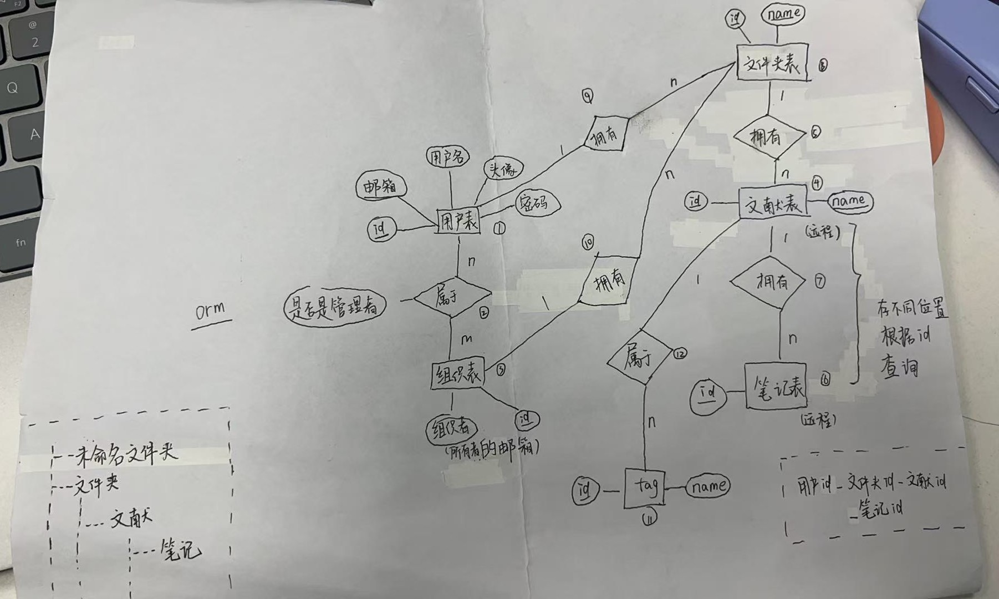

# JieNote Backend

This is the backend service for JieNote, built with FastAPI.

## Features
- RESTful API endpoints
- Modular structure for scalability

## File Structure
- `app/`: Contains the main application code.
  - `main.py`: Entry point for the FastAPI application.
  - `models/`: Database models and schemas.
  - `core/`: Core configurations and settings.
    - include database settings
    - include JWT settings
    - include CORS settings
    - ……
  - `curd/`: CRUD operations for database interactions.
  - `db/`: Database connection and session management.
  - `schemas/`: Pydantic schemas for data validation.
  - `static/`: Static files (e.g., images, CSS).
  - `routers/`: API route definitions.
- `tests/`: Contains test cases for the application.
- `requirements.txt`: List of dependencies.
- `README.md`: Documentation for the project.
- `alembic/`: Database migration scripts and configurations.
- `env/`: Virtual environment (not included in version control).
- `img/`: Images used in the project.

## Setup
1. Create a virtual environment: ✔
   ```bash
   python -m venv env
   ```
2. Activate the virtual environment: 
   - On Windows:
     ```bash
     .\env\Scripts\activate
     ```
   - On macOS/Linux:
     ```bash
     source env/bin/activate
     ```
3. Install dependencies: 
   ```bash
   pip install -r requirements.txt
   ```
4. freeze requirements(do before commit !!!): 
   ```bash
   pip freeze > requirements.txt
   ```

## Database Migration
<!-- 数据库迁移使用alembic -->
1. Install Alembic: ✔
   ```bash
   pip install alembic
   ```
2. Initialize Alembic: ✔
   ```bash
   alembic init alembic
   ```
3. Configure Alembic: ✔

   1. Edit `alembic.ini` to set the database URL.
   2. Edit `alembic/env.py` to set up the target metadata. 
      ```python
      from app.models import Base  # Import your models here
      target_metadata = Base.metadata
      ```
4. Create a migration script: need to modify the script
   ```bash
   alembic revision --autogenerate -m "提交信息"
   ```
5. Apply the migration: need to modify the script
   ```bash
   alembic upgrade head
   ```


## Run the Application
```bash
uvicorn app.main:app --reload
```

## Folder Structure
- `app/`: Contains the main application code.
- `tests/`: Contains test cases.
- `env/`: Virtual environment (not included in version control).

## ER Diagram


## License
MIT License
